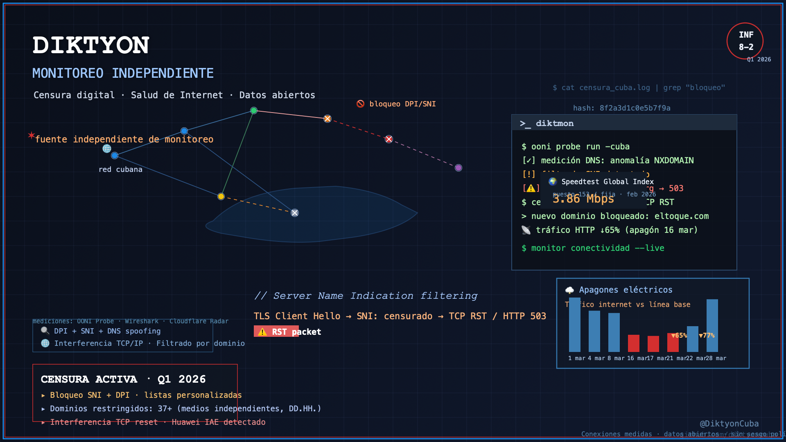

Hugo theme Stack supports the creation of interactive image galleries using Markdown. It's powered by [PhotoSwipe](https://photoswipe.com/) and its syntax was inspired by [Typlog](https://typlog.com/).

To use this feature, the image must be in the same directory as the Markdown file, as it uses Hugo's page bundle feature to read the dimensions of the image. **External images are not supported.**

## Syntax

```markdown
 
```

## Result

[](https://github.com/diktyoncuba/public/blob/main/Informes/Informe-8_Ene-Mar-2026.pdf)

> Foto
