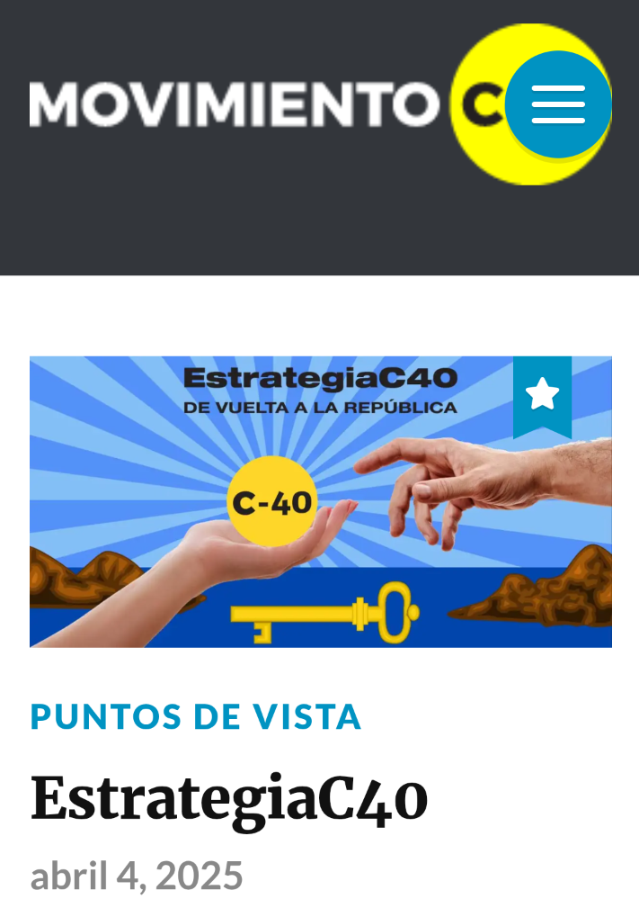
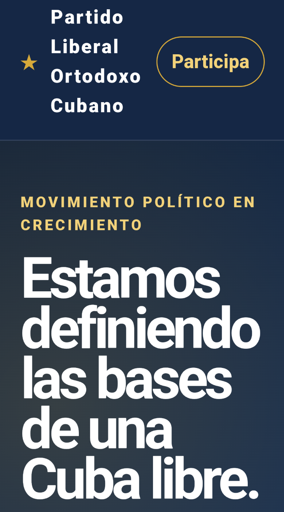
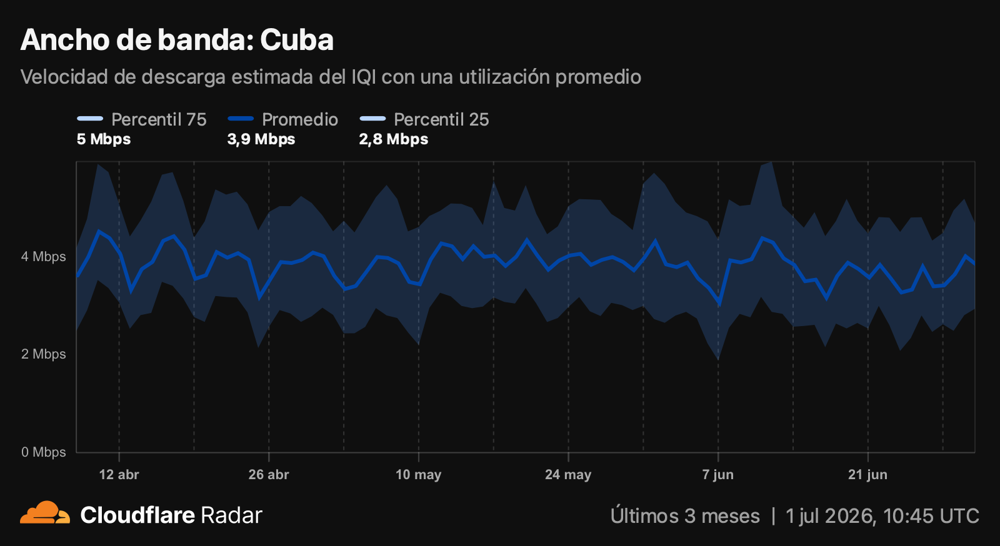
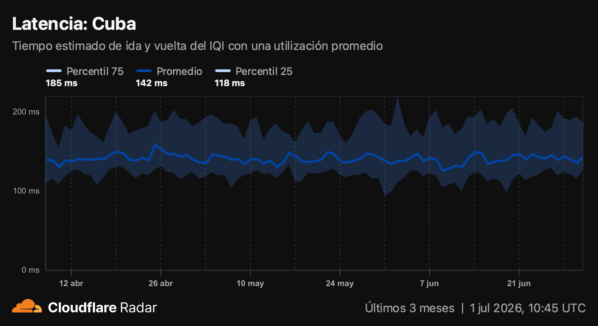
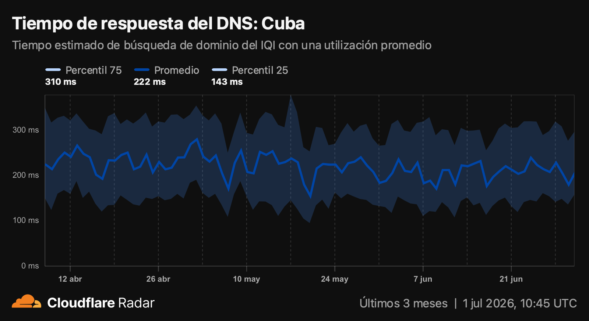
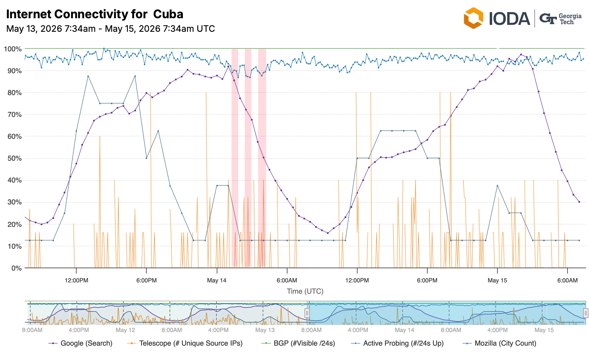
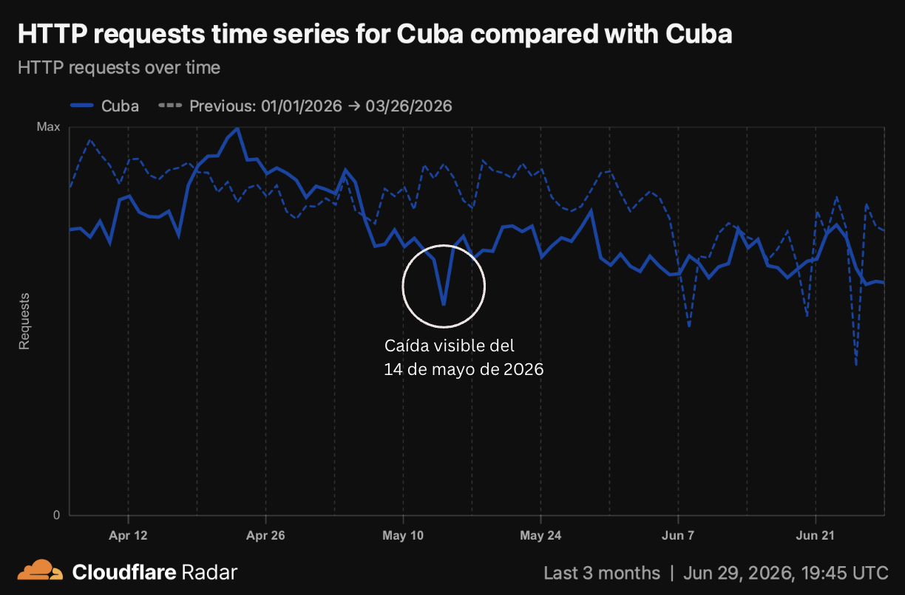
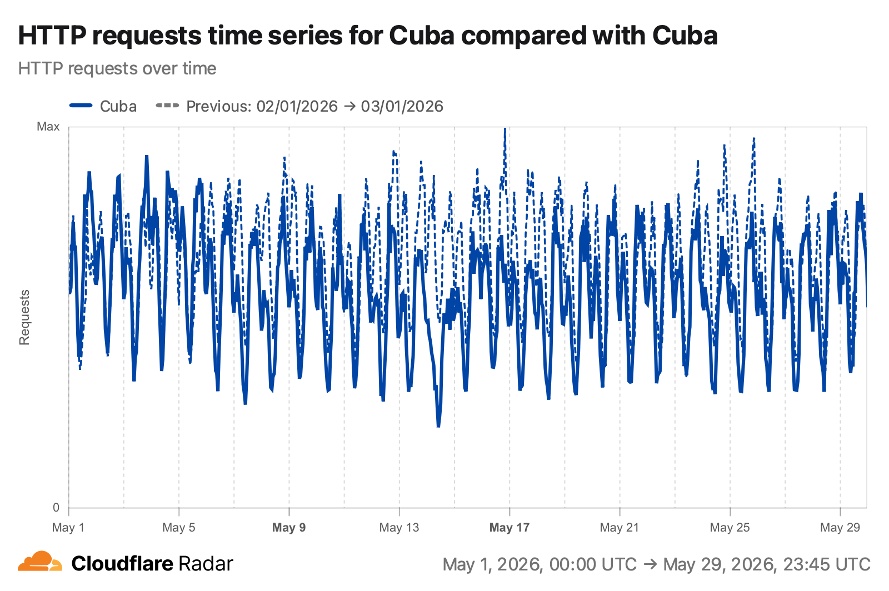
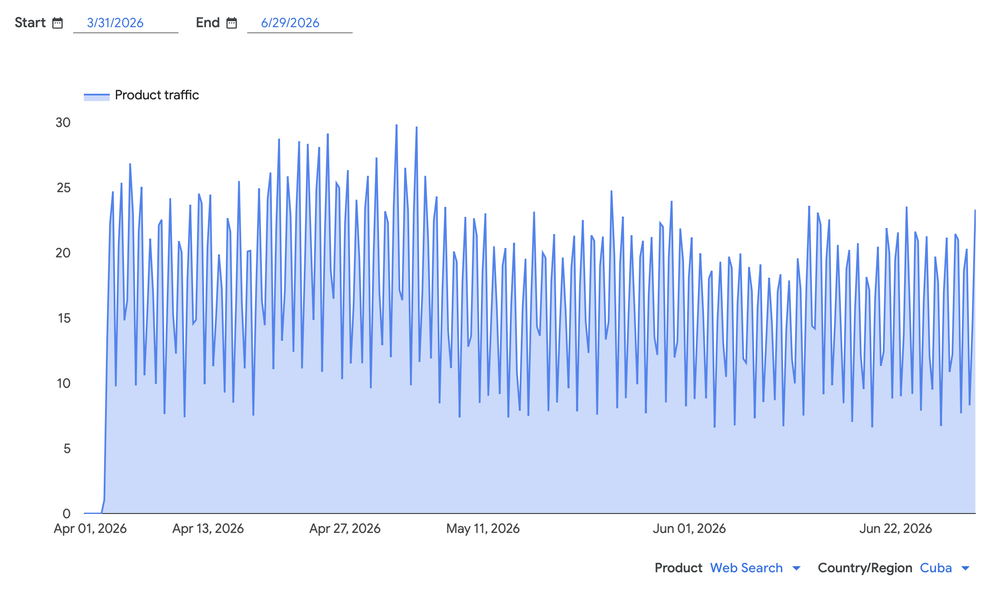
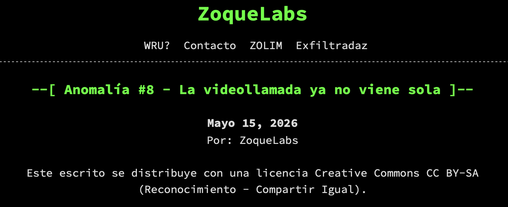

> [Descargar aquí el Informe 9 completo](https://github.com/diktyoncuba/public/blob/main/Informes/Informe-9_Abr-Jun-2026.pdf)

**Período**: *1 de abril de 2026 - 30 de junio de 2026*

## RESUMEN

Durante el segundo trimestre de 2026, la censura en Internet en Cuba mantuvo un comportamiento estable, sin detectarse nuevos dominios bloqueados ni cambios en los mecanismos técnicos de filtrado. Persistieron las limitaciones estructurales de la conectividad, marcadas por el deterioro de la infraestructura de telecomunicaciones, la exclusión de Cuba del Speedtest Global Index y una reducción del tráfico HTTP durante mayo. El período también estuvo caracterizado por interrupciones de conectividad coincidentes con protestas sociales y por nuevos indicios sobre riesgos para la seguridad de las comunicaciones, ampliando el análisis de Diktyon hacia la vigilancia del ecosistema digital.

## NOSOTROS

Diktyon es un grupo independiente dedicado al monitoreo de la censura digital, la salud de Internet y el estado de la conectividad en Cuba. A través de mediciones técnicas y análisis de datos abiertos, el grupo documenta las restricciones al acceso a la información y las interrupciones en la conectividad que afectan a las personas usuarias dentro de la isla.

El trabajo de Diktyon se basa en el uso de herramientas de medición de red, el análisis de tráfico de Internet y la recopilación de evidencias públicas sobre el comportamiento de la infraestructura digital cubana. Los resultados de estas investigaciones se presentan en informes periódicos cuyo objetivo es ofrecer una visión técnica y documentada sobre el estado de Internet en el país.

Estos informes constituyen una fuente de referencia sobre la evolución de la censura en línea y la estabilidad de la infraestructura de conectividad en Cuba.

En redes sociales: @DiktyonCuba

## INTRODUCCIÓN

El presente informe corresponde a la novena edición de Diktyon y **analiza el estado de la censura, la conectividad y la seguridad de las comunicaciones en Cuba durante el segundo trimestre de 2026 (abril-junio)**. Su objetivo es documentar, mediante evidencia técnica y el análisis de fuentes abiertas, la evolución de los mecanismos de control aplicados sobre la infraestructura nacional de Internet y evaluar su impacto sobre el acceso a la información y el ejercicio de los derechos digitales.

El período analizado estuvo marcado por la **persistencia de la crisis energética, el deterioro progresivo de la infraestructura de telecomunicaciones y un contexto de creciente tensión social**. Estos factores incidieron tanto en el funcionamiento de la red como en la disponibilidad de los servicios de Internet, dificultando el acceso a las comunicaciones digitales para una parte importante de la población.

Las mediciones realizadas por Diktyon muestran que la arquitectura técnica de censura implementada por el proveedor nacional de acceso a Internet se mantuvo estable durante el trimestre, sin evidencias de cambios significativos en los mecanismos de filtrado ni de incorporación de nuevos dominios al conjunto de sitios bloqueados. No obstante, el análisis permitió obtener nueva evidencia sobre el funcionamiento de la infraestructura de censura, aportando una caracterización más precisa de algunos de los dispositivos y técnicas empleados para restringir el acceso a contenidos en línea.

Además de la censura de contenidos, el informe examina la evolución de indicadores de calidad de la conectividad, la ocurrencia de interrupciones de Internet coincidentes con episodios de protesta social y nuevos elementos relacionados con la seguridad de las comunicaciones. En conjunto, estos hallazgos ofrecen una visión integral del ecosistema digital cubano, donde las limitaciones estructurales de la infraestructura, las restricciones económicas al acceso y los mecanismos de control sobre la red continúan configurando un entorno adverso para el ejercicio de los derechos digitales.

Como en ediciones anteriores, **Diktyon combina mediciones técnicas propias con información procedente de plataformas de monitoreo de Internet y de investigaciones independientes**. Este enfoque permite documentar de forma sistemática la evolución del ecosistema digital cubano y contribuir a una comprensión más precisa de las dinámicas de censura, conectividad y vigilancia que afectan al país.

## METODOLOGÍA

El presente informe se elaboró a partir del análisis de múltiples fuentes de datos obtenidas entre abril y junio de 2026. La metodología combina mediciones activas de conectividad, análisis de tráfico de red, monitoreo de indicadores públicos sobre el estado de Internet y revisión de información procedente de organizaciones especializadas en medición y seguridad digital.

Las mediciones de censura se realizaron mediante **OONI Probe**, ejecutando pruebas periódicas desde redes de acceso de ETECSA. Los resultados fueron analizados para identificar evidencias de interferencia en la resolución DNS, bloqueo de conexiones TCP, manipulación del protocolo HTTP y anomalías durante el establecimiento de conexiones TLS, incluyendo filtrado basado en el campo Server Name Indication (SNI). Cuando fue posible, los resultados fueron complementados mediante capturas de tráfico y análisis de paquetes para caracterizar con mayor precisión los mecanismos técnicos de filtrado observados.

La evaluación del rendimiento de Internet se basó en los indicadores publicados por **Cloudflare Radar**, incluyendo velocidad estimada de descarga, latencia, tiempo de resolución DNS y volumen agregado de tráfico HTTP. Asimismo, se revisó la disponibilidad de datos del **Speedtest Global Index de Ookla** para contextualizar el comportamiento de las mediciones de desempeño.

El análisis de posibles interrupciones de Internet combinó información procedente de **IODA**, **Cloudflare Radar**, reportes públicos de usuarios y medios de comunicación, así como anuncios oficiales relacionados con la infraestructura de telecomunicaciones y el sistema eléctrico nacional. La atribución de un evento como corte deliberado solo se realiza cuando existe evidencia técnica suficiente; en ausencia de esta, los incidentes se describen como interrupciones de conectividad coincidentes con eventos de interés.

La sección dedicada a seguridad y vigilancia incorpora información publicada por organizaciones especializadas, como **Zoque Labs**, únicamente cuando resulta relevante para comprender la evolución del ecosistema digital cubano. En estos casos, Diktyon distingue claramente entre los resultados derivados de sus propias mediciones y aquellos sustentados en investigaciones de terceros.

Las mediciones reflejan el comportamiento observado desde las redes analizadas durante el período de estudio y no permiten descartar que existan mecanismos de censura o vigilancia adicionales que no hayan sido detectados mediante las pruebas realizadas.

> LIMITACIONES METODOLÓGICAS:
> La ausencia de evidencia de bloqueo no debe interpretarse como evidencia de ausencia de censura. Algunas técnicas de filtrado pueden activarse únicamente bajo determinadas condiciones, ubicaciones geográficas, horarios o perfiles de usuario. Asimismo, ciertos incidentes de conectividad no pueden atribuirse de forma concluyente a acciones deliberadas sin disponer de mediciones activas obtenidas durante el evento.

## HALLAZGOS CLAVE

Durante el segundo trimestre de 2026 se identificaron varios eventos relevantes relacionados con el estado de la seguridad, la censura y la conectividad en Cuba:

1. **No se detectaron nuevos dominios censurados** durante el segundo trimestre de 2026. Las mediciones confirman la persistencia del mismo conjunto de sitios bloqueados identificado en informes anteriores, sin evidencia de expansión de la lista de censura..

2. **La arquitectura técnica de censura permaneció sin cambios**, manteniendo mecanismos de filtrado multinivel que incluyen interferencia DNS, inspección del campo SNI en conexiones TLS, técnicas compatibles con Deep Packet Inspection (DPI) y bloqueo selectivo a nivel TCP/IP.

3. Se obtuvo nueva evidencia técnica sobre el funcionamiento del sistema de filtrado, documentándose respuestas HTTP 503 generadas por un dispositivo de filtrado **Huawei** (V2R2C00-IAE/1.0) que intercepta conexiones HTTPS tras inspeccionar el campo SNI, proporcionando una caracterización más precisa de la infraestructura de censura.

4. La calidad del servicio de Internet continuó siendo deficiente. **Cuba volvió a quedar excluida del Speedtest Global Index** por insuficiencia de mediciones representativas, mientras Cloudflare Radar registró una velocidad media de descarga de 3,9 Mbps, una latencia de 142 ms y un tiempo medio de resolución DNS de 222 ms.

5. **Durante mayo se observó una reducción sostenida del tráfico HTTP nacional**, acompañada de una disminución del volumen de búsquedas en Internet, lo que sugiere una menor actividad del ecosistema digital durante ese mes respecto al trimestre anterior.

6. Se registró **una interrupción significativa de la conectividad el 14 de mayo**, coincidiendo con protestas por los apagones en La Habana. Aunque la evidencia disponible no permite atribuir de forma concluyente el evento a una acción deliberada de censura, su sincronía con las manifestaciones reproduce patrones observados en episodios anteriores y justifica su seguimiento.

7. El trimestre aportó nuevos indicios sobre **riesgos para la seguridad de las comunicaciones**. La investigación de Zoque Labs documentó un mecanismo de secuestro de cuentas de WhatsApp basado en la interceptación de códigos SMS, lo que amplía el análisis de Diktyon desde la censura hacia posibles capacidades de vigilancia apoyadas en el control centralizado de la infraestructura de telecomunicaciones.

> [Descargar aquí el Informe 9 completo](https://github.com/diktyoncuba/public/blob/main/Informes/Informe-9_Abr-Jun-2026.pdf)

## TECNOLOGÍAS DE CENSURA OBSERVADAS

Las mediciones realizadas durante el periodo analizado no muestran cambios significativos en las técnicas de censura previamente documentadas. Los resultados continúan evidenciando el empleo de múltiples mecanismos de interferencia de red dentro de la infraestructura de telecomunicaciones cubana, lo que indica la persistencia de una arquitectura de filtrado en múltiples capas.

Al igual que en el trimestre anterior, las evidencias recopiladas muestran que el bloqueo de contenidos no depende de un único mecanismo técnico, sino de la combinación de distintas técnicas, entre ellas la interferencia en la resolución de nombres de dominio (DNS), el filtrado basado en la extensión Server Name Indication (SNI) del protocolo TLS, la inspección profunda de paquetes (DPI) y la manipulación selectiva de conexiones TCP.

Durante el periodo no se identificaron nuevas técnicas de censura ni cambios apreciables en el comportamiento de los mecanismos previamente observados. Las técnicas descritas a continuación continúan siendo consistentes con los resultados obtenidos por las mediciones de OONI Probe y el análisis de capturas de tráfico realizadas por Diktyon.

### Filtrado basado en DNS

Las mediciones de OONI Probe muestran anomalías compatibles con interferencia en el proceso de resolución de nombres de dominio (DNS).

En condiciones normales, cuando un usuario intenta acceder a un dominio, su dispositivo consulta un servidor DNS para obtener la dirección IP correspondiente. Sin embargo, en varios de los dominios analizados se detectaron respuestas DNS anómalas que sugieren la existencia de filtrado a este nivel.

Los patrones observados incluyen:
-   respuestas NXDOMAIN para dominios que existen y resuelven correctamente desde redes de control
-   ausencia total de respuesta DNS
-   resoluciones inconsistentes entre distintos resolvers
    
Este tipo de comportamiento puede indicar:
-   manipulación de respuestas DNS por parte del proveedor de acceso  
-   filtrado implementado en resolvers controlados por el operador  
-   redirección hacia servidores DNS interceptores.
    
El filtrado DNS constituye uno de los métodos de censura más simples de implementar, aunque puede ser evadido mediante el uso de resolvers alternativos o servicios DNS cifrados.

### Filtrado basado en SNI (Server Name Indication)

Una de las técnicas de censura más consistentemente observadas en las mediciones corresponde al filtrado basado en la extensión SNI del protocolo TLS.

Durante el establecimiento de una conexión HTTPS, el cliente envía en texto claro el nombre del dominio al que desea conectarse mediante el campo Server Name Indication (SNI) dentro del handshake TLS.

Este campo permite a sistemas de inspección de red identificar el dominio solicitado antes de que se establezca la sesión cifrada.

Las mediciones muestran que en varios dominios censurados:
-   la conexión TCP se establece correctamente
-   el handshake TLS se inicia 
-   pero la conexión se interrumpe inmediatamente después del envío del campo SNI.
    
En muchos casos la interrupción ocurre mediante:
-   paquetes TCP RST
-   cierres abruptos de la sesión
-   timeouts durante el handshake TLS.
    
Este comportamiento es consistente con mecanismos de filtrado basados en inspección de metadatos TLS.

El uso de filtrado SNI es ampliamente documentado en diversos sistemas de censura a nivel mundial, ya que permite bloquear dominios HTTPS sin necesidad de descifrar el contenido del tráfico.

Las capturas de tráfico obtenidas durante las pruebas continúan mostrando un patrón consistente de filtrado basado en SNI. En particular, el análisis de las conexiones hacia [proyectoinventario.org](http://proyectoinventario.org/) confirma que un dispositivo de filtrado identificado como Huawei V2R2C00-IAE/1.0 inspecciona el campo SNI del mensaje TLS Client Hello y, cuando el dominio coincide con una política de bloqueo, responde con una página HTTP 503 en texto plano a través del puerto 443, sin completar el intercambio TLS. Este comportamiento constituye una evidencia directa de interferencia activa a nivel de red y es consistente con el funcionamiento de dispositivos comerciales de inspección y filtrado de tráfico.

El cliente envió un TLS Client Hello legítimo (frame 4) con SNI: proyectoinventario.org. El dispositivo de filtrado lee el SNI, identifica el dominio en su lista de bloqueo, y responde con una página HTTP 503 en texto plano — sin completar ningún handshake TLS, sin Server Hello, sin certificado.

El cliente detectó que la respuesta recibida en el puerto 443 no es TLS válida y emitió un TCP RST (frame 7) para cerrar la conexión abruptamente.

En el caso de las capturas por HTTP queda en evidencia al analizar las cabeceras HTTP de la respuesta de bloqueo:

*Tabla 1. Captura HTTPS del sitio proyectoinventario.org*
| #      | Tiempo(s) | Origen | Flags | Descripción |
| ----------- | ----------- | ----------- | ----------- | ----------- |
| 1      | 0.000 | Cliente  | SYN | TCP → IP:443 |
| 2      | 0.145 | Servidor | SYN-ACK | Conexión TCP aceptada (RTT = 145 ms) |
| 3      | 0.145 | Cliente  | ACK | Handshake TCP completo |
| 4      | 0.159 | Cliente  | PSH+ACK | TLS Client Hello — SNI: proyectoinventario.org |
| 5      | 0.270 | Servidor | PSH+ACK+FIN | HTTP 503 EN TEXTO CLARO por puerto 443 — SIN TLS! |
| 6      | 0.273 | Cliente  | ACK | Recibe 1.186 bytes HTTP en claro en puerto cifrado |
| 7      | 0.275 | Cliente  | RST+ACK | Cliente envía RST — detecta que la respuesta no es TLS válido |
| 8      | 5.615 | Cliente  | SYN | REINTENTO: nueva conexión TCP → 104.21.49.33:443 |
| 9      | 5.743 | Servidor | SSYN-ACK | Cloudflare acepta el reintento (RTT = 128 ms) |
| 10     | 5.743 | Cliente  | ACK | Handshake TCP completado — captura termina aquí |

Cabeceras HTTP de la respuesta de bloqueo (visibles en texto claro):
```
    HTTP/1.1 503 Service Unavailable
    Connection: close
    Server: V2R2C00-IAE/1.0
    Cache-Control: no-cache, no-store
    Content-Type: text/html
    Content-Length: 1032
```
Contenido HTML de la página de bloqueo:
```html
    <title>Web Filtering</title>
    <h1>Web Access blocked</h1>
    <p>According to the network control policy, you have no privilege to visit this web page.</p>
    <p>Blocked Type: user-defined category</p>
    <p>Category: -</p>
    <p>URL: http://proyectoinventario.org/</p>
```
Para tráfico HTTP (puerto 80), el sistema de filtrado inspecciona el header Host de la petición HTTP (en texto claro). Si el valor del header Host coincide con una URL en la lista de bloqueo, intercepta la conexión TCP. Devuelve la página 503 con Content-Length: 1032 bytes y cierra la conexión con FIN.

Para tráfico HTTPS (puerto 443), el sistema de filtrado deja pasar el handshake TCP (SYN/SYN-ACK/ACK) normalmente. Espera al TLS Client Hello del cliente, que contiene el SNI en texto claro. Si el SNI coincide con la lista de bloqueo, ignora completamente el protocolo TLS. Devuelve directamente una respuesta HTTP 503 en texto plano a través del puerto 443 — sin certificado, sin Server Hello, sin cifrado. Envía FIN para cerrar la conexión.


### Interferencia mediante inspección profunda de paquetes (DPI)

Las mediciones también muestran indicios del uso de tecnologías de inspección profunda de paquetes (Deep Packet Inspection, DPI) dentro de la infraestructura de red.

Los sistemas DPI permiten examinar el contenido y los metadatos de los paquetes de red en tiempo real con el objetivo de identificar patrones asociados a servicios, protocolos o dominios específicos.

En el contexto de la censura de Internet, estos sistemas pueden utilizarse para:
-   identificar solicitudes HTTP hacia dominios bloqueados
-   detectar extensiones TLS específicas
-   aplicar reglas de filtrado basadas en firmas de tráfico.
    
En varios de los casos analizados se detectaron patrones compatibles con inyección activa de paquetes TCP RST, lo que sugiere la presencia de dispositivos capaces de inspeccionar el tráfico y terminar conexiones de manera selectiva.

Este tipo de comportamiento es característico de sistemas de control de tráfico instalados en puntos estratégicos de la red, como gateways internacionales o nodos troncales del proveedor de acceso.

### Bloqueos a nivel TCP/IP

Además de los mecanismos anteriormente descritos, algunas mediciones muestran anomalías que pueden corresponder a interferencias en la capa de transporte del modelo TCP/IP.

Los patrones observados incluyen:
-   conexiones que nunca completan el handshake TCP
-   retransmisiones repetidas sin respuesta
-   tiempos de espera prolongados antes de la finalización de la conexión.
    
Este tipo de comportamiento puede indicar:
-   filtrado mediante listas de control de acceso (ACL)  
-   descartes selectivos de paquetes
-   limitaciones en rutas específicas de red.
    
Cuando este tipo de interferencia se aplica a nivel de infraestructura, puede resultar difícil distinguir entre censura intencional y problemas estructurales de conectividad. Sin embargo, la consistencia del comportamiento en dominios específicos sugiere la existencia de filtrado deliberado.

### Conclusiones

En conjunto, las observaciones realizadas durante este trimestre indican que la infraestructura de censura en Cuba mantiene un funcionamiento estable y sin modificaciones técnicas relevantes respecto al periodo anterior. La persistencia de estos mecanismos sugiere que el sistema de filtrado continúa operando mediante una combinación de técnicas complementarias, capaces de bloquear de forma selectiva el acceso a determinados dominios y servicios en Internet.

## COMPORTAMIENTO DE LA CENSURA DURANTE EL PERÍODO

Las mediciones realizadas entre abril y junio de 2026 no evidenciaron cambios significativos en los mecanismos técnicos de censura observados en periodos anteriores. Los dominios bloqueados continúan presentando patrones consistentes con interferencias en múltiples capas de la pila de protocolos, incluyendo filtrado durante la resolución DNS, inspección del campo Server Name Indication (SNI) en conexiones TLS, bloqueo selectivo mediante inspección profunda de paquetes (Deep Packet Inspection, DPI) e interferencias a nivel de TCP/IP.

Durante el periodo analizado tampoco se identificaron nuevas técnicas de filtrado, modificaciones en el comportamiento de la infraestructura de censura ni variaciones apreciables en los patrones de bloqueo previamente documentados. En conjunto, los resultados indican que la arquitectura de censura implementada en la red del principal proveedor de acceso a Internet en Cuba mantiene un funcionamiento estable y continúa aplicando mecanismos de bloqueo selectivo sobre los dominios considerados de interés por las autoridades.

Las variaciones observadas durante el trimestre estuvieron relacionadas con la disponibilidad o el estado operativo de algunos sitios web, y no con cambios en los mecanismos de censura empleados. En consecuencia, las diferencias identificadas en el listado de dominios analizados deben interpretarse principalmente como resultado de la incorporación de nuevos sitios al proceso de medición o de incidencias propias de los servicios evaluados, más que como evidencia de una modificación en la estrategia técnica de filtrado.


## DOMINIOS CENSURADOS

Durante el segundo trimestre de 2026 no se identificaron nuevos dominios sujetos a bloqueo desde las redes de acceso a Internet en Cuba. Las mediciones realizadas mediante la metodología empleada por Diktyon mantuvieron resultados consistentes con los obtenidos en trimestres anteriores, confirmando la persistencia de los bloqueos previamente documentados.

La ausencia de nuevas incorporaciones al conjunto de dominios censurados constituye, en sí misma, un resultado relevante. Los datos recopilados indican que el sistema de filtrado aplicado por el ISP nacional mantuvo un comportamiento estable durante el periodo analizado, sin evidencias de expansión hacia nuevas categorías de sitios web ni modificaciones apreciables en las técnicas de bloqueo utilizadas.

Continúan afectados principalmente medios de comunicación independientes, organizaciones de derechos humanos, iniciativas de participación ciudadana, plataformas de activismo cívico, proyectos culturales independientes y otros servicios considerados sensibles por las autoridades cubanas. La permanencia de estos bloqueos durante varios periodos consecutivos refuerza la hipótesis de que responden a una política sostenida de restricción del acceso a información, más que a medidas temporales o reactivas.

> La ausencia de nuevas detecciones no implica una reducción de la actividad de monitoreo. Por el contrario, durante el periodo se mantuvo la misma cobertura geográfica, el mismo conjunto de pruebas y la misma metodología utilizada en informes anteriores, permitiendo comparar los resultados entre distintos periodos y detectar oportunamente cualquier cambio en la política de censura.

Durante mayo de 2026 se registraron incidentes de seguridad dirigidos contra los sitios [movimientoc40.com](https://movimientoc40.com/) y [partidoliberalortodoxocubano.com](https://www.partidoliberalortodoxocubano.com/), coincidiendo con un contexto de incremento de la conflictividad social y de la actividad represiva en Cuba. Sin embargo, las mediciones realizadas por Diktyon no detectaron evidencia de bloqueo de ninguno de estos dominios desde las redes del ISP cubano durante el periodo de análisis. Esta observación pone de manifiesto que la ocurrencia de ataques o incidentes contra plataformas vinculadas con la oposición o la sociedad civil no implica necesariamente su incorporación al conjunto de sitios censurados mediante mecanismos de filtrado a nivel de red.


*Imagen 1. El Movimiento Constitucionalista Cubano (MovimientoC40) es una iniciativa política fundada en 2019 cuya propuesta central consiste en la restitución de la Constitución cubana de 1940, argumentando que continúa siendo la norma legítima del Estado cubano debido a que fue interrumpida por el golpe de Estado de 1952 y posteriormente sustituida tras la Revolución de 1959.*


*Imagen 2. El sitio corresponde al Partido Liberal Ortodoxo Cubano (PLOC), un proyecto político que comenzó a hacerse público durante mayo de 2026 y que se presenta como una organización de orientación liberal-democrática.*

En consecuencia, el universo de dominios bloqueados permaneció sin variaciones respecto al informe anterior, manteniéndose el mismo patrón de restricciones documentado por Diktyon en campañas de medición precedentes. La continuidad de este comportamiento facilita la comparación longitudinal de los resultados y constituye un indicador adicional de la estabilidad de las políticas de censura implementadas sobre la infraestructura nacional de acceso a Internet. En los anexos de este documento puede verse el listado completo de sitios censurados por el ISP cubano, ETECSA.

## VELOCIDAD DEL INTERNET

### Exclusión de Cuba del Speedtest Global Index

En el segundo trimestre de 2026, Cuba no fue incluida en el Speedtest Global Index de Ookla. Esta ausencia responde a la metodología empleada por la plataforma para la elaboración del índice y no debe interpretarse, por sí sola, como evidencia de un deterioro del rendimiento de la red.

Desde junio de 2024, Ookla sustituyó el criterio basado principalmente en el volumen de pruebas por un Precision Threshold(umbral de precisión estadística). Bajo esta metodología, un país solo es incorporado al índice cuando el conjunto de mediciones disponibles permite estimar la mediana nacional de velocidad con un intervalo de confianza del 95 % cuyo margen de error no exceda ±5 %. Si este requisito no se cumple, el país es excluido del ranking.

En consecuencia, la ausencia de Cuba indica que Ookla no dispuso de un volumen de mediciones suficientemente amplio y representativo para alcanzar el nivel de precisión estadística exigido por su metodología. Esto no implica necesariamente una disminución de la velocidad de acceso a Internet, sino una insuficiente confianza estadística para estimar dicho indicador a escala nacional.

No obstante, este resultado adquiere mayor relevancia cuando se analiza conjuntamente con los datos de Cloudflare Radar. Durante el período comprendido entre abril y junio de 2026 se observó una reducción del tráfico HTTP nacional respecto al trimestre anterior (véase Imagen 8). Una disminución de la actividad general de Internet es consistente con una reducción del número de pruebas de velocidad realizadas, una menor diversidad geográfica de las mediciones y una mayor concentración de las muestras en determinados segmentos de usuarios o redes, factores que incrementan la incertidumbre estadística y pueden impedir que un país alcance el umbral de precisión requerido por Ookla.

En conjunto, la evidencia disponible muestra una correlación temporal entre la exclusión de Cuba del Speedtest Global Index, la reducción del tráfico HTTP registrada por Cloudflare Radar y el deterioro observado en otros indicadores de calidad de la conectividad. Aunque estos elementos no permiten establecer una relación causal directa, sí constituyen evidencias consistentes de una disminución en la actividad y la observabilidad del ecosistema nacional de Internet durante el período analizado, compatible con las limitaciones operacionales de la infraestructura de telecomunicaciones y la persistencia de interrupciones en el suministro eléctrico.

Los indicadores de calidad de Internet publicados por Cloudflare Radar muestran que, durante el segundo trimestre de 2026, Cuba registró una velocidad media estimada de descarga de 3,9 Mbps, con un rango intercuartílico comprendido entre 2,8 Mbps (percentil 25) y 5,0 Mbps (percentil 75). Este número es similar al obtenido el primer trimestre de 2026 (3,86 Mbps) que sirvió para ubicar a Cuba en el penúltimo puesto a nivel mundial. Asimismo, la latencia media se situó en 142 ms, mientras que el tiempo medio de respuesta DNS alcanzó 222 ms. Aunque el ancho de banda disponible se mantuvo relativamente estable a lo largo del período, los elevados valores de latencia y de resolución DNS reflejan una conectividad con tiempos de respuesta significativamente superiores a los observados en la mayoría de las redes modernas, lo que repercute negativamente en aplicaciones interactivas como la navegación web, las videoconferencias y los servicios en tiempo real.


*Imagen 3. Se muestra la velocidad media estimada de descarga medida por el Internet Quality Index (IQI) de Cloudflare Radar. La línea central representa el promedio diario, mientras que la banda sombreada corresponde al intervalo comprendido entre los percentiles 25 y 75 de las mediciones. Fuente: Cloudflare Radar.*


*Imagen 4. Se muestra la latencia estimada de ida y vuelta (RTT) del Internet Quality Index (IQI) de Cloudflare Radar. La línea central representa el promedio diario y la banda sombreada muestra los percentiles 25 y 75 de las observaciones. Fuente: Cloudflare Radar.*


*Imagen 5. Tiempo estimado de resolución de consultas DNS del Internet Quality Index (IQI) de Cloudflare Radar. La línea central representa el promedio diario y la banda sombreada indica los percentiles 25 y 75 de las mediciones. Fuente: Cloudflare Radar.*


## CORTES DE INTERNET

Durante el segundo trimestre de 2026, la disponibilidad de Internet en Cuba continuó deteriorándose como consecuencia de la convergencia de tres factores principales: la degradación progresiva de la infraestructura de telecomunicaciones de ETECSA, la persistencia de políticas económicas que restringen el acceso asequible al servicio y la ocurrencia de interrupciones de conectividad coincidentes con episodios de tensión social.

A diferencia de los trimestres anteriores, los eventos registrados durante este período muestran que la crisis energética dejó de ser únicamente un factor indirecto de degradación del servicio para convertirse en un elemento que incrementa la vulnerabilidad de toda la infraestructura nacional de telecomunicaciones. Paralelamente, se documentaron interrupciones de conectividad cuya sincronía con manifestaciones ciudadanas reproduce patrones previamente observados en Cuba durante eventos de protesta.

### Degradación de la infraestructura de ETECSA

Por primera vez desde el inicio de esta serie de informes, existen declaraciones públicas de directivos de la Empresa de Telecomunicaciones de Cuba S.A. (ETECSA) que reconocen explícitamente el deterioro de la infraestructura nacional de telecomunicaciones como consecuencia de la crisis energética.

En febrero de 2026, el director territorial de ETECSA en Villa Clara confirmó que las radiobases de telefonía móvil, las zonas públicas WiFi y los gabinetes de telefonía fija estaban siendo afectados de forma recurrente por los prolongados cortes eléctricos. Según sus declaraciones, la empresa carece del combustible necesario para mantener operativos los grupos electrógenos destinados al respaldo de estas instalaciones.

Especialmente relevante resulta el reconocimiento de que la mayor parte de los sistemas de alimentación ininterrumpida (UPS) y de las baterías de respaldo instaladas en la red ya habían agotado su vida útil, reduciendo significativamente la resiliencia de la infraestructura frente a interrupciones del suministro eléctrico.

El directivo añadió además que las inversiones previstas por ETECSA para 2026 serían “mínimas”, lo que anticipa una capacidad muy limitada para renovar equipamiento crítico o ampliar la infraestructura existente.

Estas declaraciones constituyen uno de los primeros reconocimientos oficiales de que la degradación de la infraestructura de telecomunicaciones ha alcanzado un nivel que compromete la continuidad operativa de la red nacional.

Desde una perspectiva técnica, la combinación de apagones prolongados, escasez de combustible para generación auxiliar, envejecimiento de los sistemas de respaldo eléctrico y ausencia de inversionesincrementa considerablemente la probabilidad de interrupciones parciales del servicio, congestión de la red móvil y pérdida de cobertura en determinadas zonas del país.

### Persistencia de restricciones económicas al acceso a Internet

En junio de 2026, el Gobierno cubano anunció un paquete de 176 medidas económicas y sociales orientadas, según las autoridades, a impulsar la actividad económica, flexibilizar determinados mecanismos de inversión y modernizar el sistema financiero.

Entre las medidas divulgadas se incluyeron reformas relacionadas con la inversión extranjera, modificaciones del sistema bancario, incentivos para determinadas formas de gestión privada y cambios salariales. Sin embargo, el paquete no contempló ninguna modificación sustancial de la política comercial aplicada por ETECSAdesde mayo de 2025.

En particular, se mantuvieron sin cambios:
-   el límite de las recargas nacionales; 
-   la comercialización de planes de datos de mayor capacidad exclusivamente en moneda libremente convertible (MLC);
-   la ausencia de una reducción generalizada de las tarifas de acceso a Internet para usuarios que perciben ingresos únicamente en pesos cubanos.
    
La ausencia de medidas destinadas a mejorar la asequibilidad del acceso a Internet contrasta con el creciente énfasis gubernamental en la digitalización de servicios públicos, la expansión de los pagos electrónicos y el impulso del trabajo remoto.

Como resultado, persiste una contradicción estructural  entre la creciente dependencia de la conectividad para realizar actividades económicas y administrativas y las restricciones económicas que limitan el acceso efectivo de una parte significativa de la población a servicios de Internet de calidad.

### Interrupciones de Internet durante el segundo trimestre de 2026

El segundo trimestre de 2026 estuvo marcado por una intensificación de la crisis energética nacional y por la aparición de interrupciones de Internet coincidentes con episodios de protesta social, un patrón cualitativamente distinto al observado durante el primer trimestre, donde las afectaciones registradas parecían estar asociadas principalmente a fallos derivados de los apagones (véase [Informe No. 8, Diktyon](https://github.com/diktyoncuba/public/blob/main/Informes/Informe-8_Ene-Mar-2026.pdf)).

Durante la madrugada del 14 de mayo de 2026, periodistas independientes, organizaciones de la sociedad civil y numerosos usuarios reportaron una caída generalizada de los servicios de Internet móvil en La Habana mientras se desarrollaban protestas relacionadas con los prolongados cortes eléctricos que afectaban a la capital.

> La atribución de un corte de Internet requiere evidencia técnica suficiente para diferenciar entre fallos de infraestructura, degradación provocada por limitaciones energéticas y restricciones intencionales impuestas por el operador de red. En ausencia de mediciones activas realizadas durante el incidente (por ejemplo, pruebas de conectividad, análisis BGP, DNS, HTTP o datos de sondas distribuidas), este informe clasifica el evento del 14 de mayo como una interrupción de conectividad coincidente con protestas sociales, evitando una atribución concluyente sobre su causa. No obstante, la coincidencia temporal con las manifestaciones y la existencia de precedentes documentados justifican su inclusión dentro del monitoreo de posibles restricciones deliberadas del acceso a Internet.

Las interrupciones fueron reportadas simultáneamente por múltiples fuentes independientes, que describieron dificultades para acceder a servicios de datos móviles y aplicaciones de mensajería durante el desarrollo de las manifestaciones.

Los eventos ocurrieron en un contexto de una grave crisis del sistema eléctrico nacional. Ese mismo día, el ministro de Energía y Minas, Vicente de la O Levy, reconoció públicamente que amplias zonas de La Habana experimentaban interrupciones del servicio eléctrico superiores a las veinte horas diarias. Paralelamente, la Unión Nacional Eléctrica informó un déficit de generación superior a los 2.100 MW, con una disponibilidad de aproximadamente 1.230 MW frente a una demanda cercana a los 3.250 MW.


*Imagen 6. Según IODA, entre las 01:00 y las 04:00 (UTC), el porcentaje de prefijos alcanzables mediante sondeos activos permanece relativamente estable, con una ligera disminución de unos pocos puntos porcentuales. La ausencia de una caída pronunciada sugiere que no se produjo un fallo generalizado del plano de encaminamiento (routing) ni una pérdida masiva de alcance de la red cubana. Fuente: IODA*

Aunque las interrupciones de conectividad podrían verse agravadas por la inestabilidad del suministro eléctrico y la degradación de la infraestructura de ETECSA descrita anteriormente, la coincidencia temporal entre la caída de Internet y las protestas reproduce un patrón documentado en eventos anteriores.

Durante las manifestaciones nacionales del 11 de julio de 2021, diversas organizaciones de medición de Internet documentaron bloqueos selectivos contra plataformas de comunicación como WhatsApp, Telegram, Facebook e Instagram, además de interrupciones generalizadas del servicio de Internet móvil. En un entorno donde ETECSA mantiene el monopolio absoluto de la infraestructura nacional de telecomunicaciones, la arquitectura centralizada de la red permite la aplicación de restricciones de conectividad de alcance nacional o regional mediante decisiones administrativas.


*Imagen 7. El tráfico HTTP agregado de Cuba presenta una caída abrupta y de corta duración alrededor del 14 de mayo de 2026, claramente diferenciable de la variabilidad observada en los días inmediatamente anteriores y posteriores. Fuente: Cloudflare Radar*

A la fecha de elaboración de este informe no existen datos técnicos suficientes para atribuir de forma concluyente las interrupciones del 14 de mayo a una acción deliberada de censura. Sin embargo, la correlación temporal entre las protestas y la pérdida de conectividad, junto con los antecedentes históricos de restricciones durante episodios de movilización social, hacen que estos eventos merezcan un seguimiento específico en futuros informes.

### Caída en el volumen de peticiones HTTP desde Cuba

Durante el segundo trimestre de 2026, lo primero que llama la atención es que mayo es el único de los tres meses analizados (abril, mayo y junio) en el que Cloudflare Radar muestra una reducción sistemática del tráfico HTTP respecto al período de referencia. En abril (comparado con enero) y en junio (comparado con marzo) la serie histórica mantiene un comportamiento prácticamente superpuesto, mientras que durante mayo la curva correspondiente al trimestre analizado se sitúa, durante buena parte del mes, por debajo de la del período de referencia.

Esta diferencia no responde únicamente al descenso puntual del 14 de mayo. Más bien parece existir un desplazamiento del nivel medio de tráfico durante todo el mes, especialmente apreciable en el segundo tercio del mes, fundamentalmente. Es decir, el tráfico HTTP conserva su patrón diario (con los mismos ciclos de actividad y descanso), pero se desarrolla sobre un nivel inferior al observado en febrero.


*Imagen 8. Al combinar las dos fuentes (Cloudflare Radar y Google Trends aparece un patrón bastante interesante que merece ser comentado en el informe. Durante mayo la curva de tráfico HTTP correspondiente al mes de mayo de 2026 se muestra por debajo de la del mes de febrero de 2026. Fuente: Cloudflare Radar*


*Imagen 9. En la gráfica de búsquedas de Internet durante el segundo trimestre de 2026 el volumen relativo de búsquedas también experimenta un ligero descenso durante mayo, alcanzando su mínimo precisamente alrededor del 14 de mayo antes de recuperarse parcialmente en los días posteriores. Fuente: Google.*

## SEGURIDAD Y VIGILANCIA DE LAS COMUNICACIONES

Durante el segundo trimestre de 2026 se documentó un nuevo mecanismo de compromiso de cuentas de mensajería que, de confirmarse, evidencia capacidades de vigilancia que trascienden la censura tradicional y aprovechan el control estatal sobre la infraestructura móvil.


*Imagen 10. Captura del informe Anomalía #8 de Zoque Labs. Fuente: Zoque Labs (2026).*


El boletín [Anomalía #8](https://t.co/G6AF2bGwRT), publicado por Zoque Labs el 15 de mayo de 2026, describe una serie de incidentes dirigidos contra periodistas independientes, activistas y miembros de organizaciones de la sociedad civil cubana. De acuerdo con la investigación, los atacantes lograron secuestrar cuentas de WhatsApp interceptando los mensajes SMS utilizados por la plataforma para verificar la transferencia de una cuenta a un nuevo dispositivo.

El patrón de ataque documentado consiste en tres etapas principales:
-   inicio del proceso de transferencia de la cuenta de WhatsApp por parte del atacante;
-   interceptación del código de verificación enviado mediante SMS antes de que este llegue al dispositivo de la víctima;
-   toma de control de la cuenta mediante el cierre de sesiones existentes, modificación de las credenciales de recuperación y acceso a conversaciones, contactos y grupos.
    
A diferencia de campañas de phishing o de la instalación de malware en los dispositivos de las víctimas, este mecanismo depende del acceso al canal de señalización o entrega de mensajes SMS de la red móvil. En el contexto cubano, donde el servicio de telefonía móvil es operado exclusivamente por ETECSA, la hipótesis planteada por Zoque Labs y Havana Times es consistente con un escenario en el que un actor con acceso privilegiado a la infraestructura de telecomunicaciones podría interceptar los códigos de autenticación enviados por WhatsApp.

> Nota metodológica: Diktyon no realizó mediciones directas que permitan verificar de manera independiente la interceptación de mensajes SMS descrita en este apartado. La información se basa en la investigación publicada por Zoque Labs y en los testimonios recopilados por Havana Times. Debido a la naturaleza de este tipo de operaciones, su verificación independiente resulta especialmente compleja sin acceso a registros de la infraestructura de telecomunicaciones o a evidencia forense adicional.

Aunque este tipo de incidentes no constituye un evento de censura de Internet en sentido estricto, sí representa una amenaza significativa para la confidencialidad de las comunicaciones y para la seguridad digital de usuarios considerados de alto riesgo. El caso evidencia que el control centralizado de la infraestructura nacional de telecomunicaciones puede facilitar operaciones de vigilancia dirigidas sin necesidad de desplegar software malicioso en los dispositivos comprometidos.

Este incidente amplía el panorama observado por Diktyon en informes anteriores, donde se han documentado bloqueos de servicios, restricciones temporales del acceso a Internet y filtrado de contenidos. En conjunto, estos elementos sugieren una estrategia de control del ecosistema digital que combina mecanismos de restricción del acceso con capacidades potenciales de vigilancia sobre la infraestructura de comunicaciones.

Desde la perspectiva de la salud del ecosistema de Internet, estos hechos reflejan un deterioro de la dimensión de seguridad y confianza de las comunicaciones. La existencia de una infraestructura altamente centralizada reduce las posibilidades de supervisión independiente y aumenta el riesgo de que servicios diseñados para proteger la privacidad de los usuarios puedan ser vulnerados mediante el control de la red de telecomunicaciones.

## CONCLUSIONES

Las mediciones realizadas durante el segundo trimestre de 2026 muestran que **la infraestructura de censura de Internet en Cuba mantuvo un comportamiento estable**. No se identificaron nuevos dominios bloqueados ni cambios sustanciales en las técnicas de filtrado empleadas, lo que refuerza la hipótesis de que el sistema de censura continúa operando mediante una arquitectura consolidada basada en mecanismos multinivel, que combinan interferencia DNS, inspección del campo Server Name Indication (SNI), inspección profunda de paquetes (DPI) y bloqueos selectivos a nivel de transporte.

Aunque la política de bloqueo permaneció sin variaciones apreciables, **el período analizado permitió obtener una caracterización más precisa de algunos de los mecanismos técnicos empleados por la infraestructura de filtrado**. En particular, la documentación de respuestas HTTP 503 generadas por dispositivos de filtrado durante el establecimiento de conexiones HTTPS aporta nueva evidencia sobre el funcionamiento de los sistemas de censura desplegados en la red nacional.

En paralelo, los indicadores de conectividad continúan reflejando un ecosistema de Internet condicionado por limitaciones estructurales. **La persistencia de bajas velocidades de acceso, elevados tiempos de latencia, la reducción del tráfico HTTP observada durante mayo y las propias declaraciones de directivos de ETECSA sobre el deterioro de la infraestructura** evidencian que la crisis energética y la escasa capacidad de inversión siguen afectando de forma significativa la resiliencia de la red.

Las interrupciones de conectividad registradas durante las **protestas del 14 de mayo** ilustran la dificultad de atribuir de manera concluyente determinados eventos en un entorno donde convergen deficiencias estructurales de la infraestructura y antecedentes documentados de restricciones deliberadas del acceso a Internet. Aunque la evidencia disponible no permite confirmar que se tratara de un corte intencional, la coincidencia temporal con las manifestaciones y los patrones observados en eventos anteriores justifican mantener un seguimiento específico de este tipo de incidentes.

Finalmente, los resultados presentados en este informe ponen de manifiesto que **la evaluación de la salud de Internet en Cuba no debe limitarse exclusivamente a indicadores de disponibilidad, rendimiento o censura**. La seguridad de las comunicaciones constituye una dimensión cada vez más relevante para comprender el estado del ecosistema digital del país. Los mecanismos de vigilancia, el compromiso de cuentas de mensajería y otras amenazas dirigidas contra periodistas, activistas y organizaciones de la sociedad civil evidencian que el control del entorno digital puede ejercerse no solo mediante la interrupción o restricción del acceso a Internet, sino también mediante la afectación de la confidencialidad e integridad de las comunicaciones. En este contexto, futuras ediciones de Diktyon podrán ampliar progresivamente su marco de análisis para incorporar indicadores y metodologías orientadas a evaluar esta dimensión de la salud de Internet, ofreciendo así una evaluación más integral de la resiliencia, la apertura y la seguridad del ecosistema digital cubano.

## AGRADECIMIENTOS

El equipo de Diktyon expresa su más sincero agradecimiento a **todas las personas y organizaciones que, de manera voluntaria**, contribuyen al monitoreo de la conectividad, la censura digital y la salud de Internet en Cuba mediante la realización de mediciones de red, la recopilación y el intercambio de evidencia técnica, así como la difusión de información especializada sobre el estado del ecosistema digital del país.

Este informe no sería posible sin la colaboración de quienes ejecutan pruebas desde redes cubanas utilizando herramientas de medición abierta y apoyan la verificación independiente de los resultados. Su participación fortalece la transparencia, la reproducibilidad de las mediciones y la capacidad de documentar de forma rigurosa la evolución de la censura y la conectividad en Cuba.

Expresamos un reconocimiento especial a **YucaByte**, por su compromiso con la promoción de los derechos digitales y el fortalecimiento de una Internet libre y abierta para los cubanos, así como a **VeSinFiltro**, cuyo trabajo de documentación y monitoreo de la censura en Internet constituye una valiosa referencia para la región y complementa los esfuerzos de medición desarrollados por Diktyon.

Asimismo, agradecemos a los equipos de **OONI** (Open Observatory of Network Interference), **Cloudflare Radar**, **IODA** (Internet Outage Detection and Analysis) y **Zoque Labs**, cuyas plataformas, metodologías, datos e investigaciones aportan herramientas fundamentales para el análisis independiente de la conectividad, la censura y la seguridad de las comunicaciones. Sus contribuciones fortalecen el desarrollo de investigaciones abiertas y reproducibles sobre el estado de Internet a nivel mundial.

Finalmente, extendemos nuestro agradecimiento a todas las personas, investigadores, periodistas, activistas, organizaciones de la sociedad civil y comunidades técnicas que, desde Cuba y el exterior, continúan compartiendo información, realizando observaciones y aportando evidencia que contribuye a una mejor comprensión de la evolución del ecosistema digital cubano. Su compromiso con la transparencia y la defensa de los derechos digitales constituye un elemento esencial para el monitoreo independiente de Internet en el país.

> [Descargar aquí el Informe 9 completo](https://github.com/diktyoncuba/public/blob/main/Informes/Informe-9_Abr-Jun-2026.pdf)

## ANEXO

### Listado de sitios censurados en Cuba


*Leyenda*
| Código | Descripción |
|---------|-------------|
| NEWS | Sitios de noticias |
| HUMR | Sitios de derechos humanos |
| POLR | Sitios críticos con el gobierno |
| REL | Sitios relacionados con la religión |
| ANON | Herramientas de elusión y anonimización |
| COMT | Herramientas de comunicación |
| ACT | Sitios relacionados con el activismo |
| TUR | Sitios relacionados con el turismo |
| CULTR | Sitios relacionados con la cultura |
| ALDR | Alcohol y drogas |
| SRCH | Motores de búsqueda |
| 11S | Temática 11S |

*Tabla con la lista de sitios censurados en Cuba. Fuente: Diktyon (2026).*
| # | Dominio | Categoría | Enero HTTP | Enero HTTPS | Febrero HTTP | Febrero HTTPS | Marzo HTTP | Marzo HTTPS |
|---:|----------|:---------:|-------------|--------------|---------------|----------------|-------------|--------------|
| 1 | gatopardo.com | NEWS | Sin resultados | Sin resultados | Sin resultados | Sin resultados | Bloqueo de HTTP | Accesible |
| 2 | nieman.harvard.edu | NEWS | Sin resultados | Accesible | Sin resultados | Accesible | Sin resultados | Accesible |
| 3 | 14ymedio.com | NEWS | Sin resultados | Sin resultados | Sin resultados | Sin resultados | Bloqueo de TCP/IP | Bloqueo de TCP/IP |
| 4 | cibercuba.com | NEWS | Sin resultados | Sin resultados | Sin resultados | Bloqueo de HTTP | Bloqueo por DPI, Bloqueo de HTTP | Bloqueo de HTTP |
| 5 | cubanet.org | NEWS | Sin resultados | Sin resultados | Sin resultados | Sin resultados | Bloqueo de HTTP | Bloqueo de HTTP |
| 6 | diariodecuba.com | NEWS | Sin resultados | Bloqueo de HTTP | Sin resultados | Bloqueo de HTTP | Bloqueo por DPI, Bloqueo de HTTP | Bloqueo de HTTP |
| 7 | cubaencuentro.com | NEWS | Sin resultados | Sin resultados | Sin resultados | Sin resultados | Bloqueo por DPI, Bloqueo de HTTP | Fallida |
| 8 | payolibre.com | NEWS | Sin resultados | Sin resultados | Sin resultados | Fallida | Bloqueo por DPI, Bloqueo de HTTP | Fallida |
| 9 | periodicocubano.com | NEWS | Sin resultados | Sin resultados | Sin resultados | Sin resultados | Bloqueo por DPI, Bloqueo de HTTP | Bloqueo de HTTP |
| 10 | univision.com | NEWS | Sin resultados | Sin resultados | Sin resultados | Sin resultados | Bloqueo de TCP/IP | Bloqueo de TCP/IP |
| 11 | asere.com | NEWS | Fallida / Bloqueo de HTTP | Fallida / Bloqueo de HTTP | Bloqueo de HTTP | Bloqueo de HTTP | Bloqueo de HTTP | Bloqueo de HTTP |
| 12 | cubanosporelmundo.com | NEWS | Sin resultados | Fallida / Bloqueo de HTTP | Sin resultados | Bloqueo de HTTP, Fallida | Bloqueo de HTTP | Bloqueo de HTTP |
| 13 | rialta.org | NEWS | Sin resultados | Sin resultados | Sin resultados | Fallida | Bloqueo por DPI | Fallida, Accesible |
| 14 | adncuba.com | NEWS | Sin resultados | Bloqueo de HTTP | Sin resultados | Sin resultados | Bloqueo por DPI | Bloqueo de HTTP |
| 15 | martinoticias.com | NEWS | Sin resultados | Sin resultados | Sin resultados | Fallida | Bloqueo por DPI | Fallida |
| 16 | libertaddigital.com | NEWS | Sin resultados | Sin resultados | Sin resultados | Bloqueo de TCP/IP | Bloqueo de TCP/IP, Bloqueo de HTTP | Bloqueo de TCP/IP, Bloqueo de HTTP |
| 17 | cafefuerte.com | NEWS | Sin resultados | Fallida | Sin resultados | Fallida | Sin resultados | Fallida |
| 18 | voanews.com | NEWS | Sin resultados | Fallida | Sin resultados | Sin resultados | Sin resultados | Sin resultados |
| 19 | cubaenmiami.com | NEWS | Sin resultados | Sin resultados | Sin resultados | Sin resultados | Sin resultados | Sin resultados |
| 20 | cubanology.com | NEWS | Sin resultados | Sin resultados | Sin resultados | Bloqueo de TCP/IP | Sin resultados | Fallida |
| 21 | nuevoaccion.blogspot.com | NEWS | Sin resultados | Sin resultados | Sin resultados | Sin resultados | Sin resultados | Sin resultados |
| 22 | americateve.com | NEWS | Sin resultados | Sin resultados | Sin resultados | Sin resultados | Sin resultados | Sin resultados |
| 23 | somosmascuba.com | NEWS | Sin resultados | Sin resultados | Sin resultados | Sin resultados | Sin resultados | Sin resultados |
| 24 | cuballama.com | NEWS | Sin resultados | Sin resultados | Sin resultados | Sin resultados | Sin resultados | Sin resultados |
| 25 | cubasindical.org | HUMR | Sin resultados | Sin resultados | Sin resultados | Sin resultados | Bloqueo de TCP/IP | Fallida |
| 26 | damasdeblanco.com | HUMR | Sin resultados | Sin resultados | Sin resultados | Fallida | Bloqueo por DPI, Bloqueo de HTTP | Fallida |
| 27 | freedomhouse.org | HUMR | Sin resultados | Fallida | Sin resultados | Fallida | Bloqueo por DPI, Bloqueo de HTTP | Fallida |
| 28 | victimsofcommunism.org | HUMR | Sin resultados | Bloqueo de TCP/IP | Sin resultados | Bloqueo de TCP/IP | Bloqueo de TCP/IP | Bloqueo de TCP/IP |
| 29 | canf.org | HUMR | Sin resultados | Sin resultados | Sin resultados | Sin resultados | Bloqueo por DPI, Bloqueo de HTTP | Fallida |
| 30 | cubacenter.org | HUMR | Sin resultados | Sin resultados | Sin resultados | Sin resultados | Bloqueo de TCP/IP | Bloqueo de TCP/IP |
| 31 | cubafreepress.org | HUMR | Bloqueo de TCP/IP, Bloqueo de HTTP, Fallida | Bloqueo de TCP/IP | Bloqueo de TCP/IP, Bloqueo de HTTP | Bloqueo de TCP/IP | Bloqueo de TCP/IP, Bloqueo de HTTP | Bloqueo de TCP/IP |
| 32 | solidaridadconcuba.com | HUMR | Bloqueo por DPI, Bloqueo de HTTP | Fallida | Bloqueo por DPI, Bloqueo de HTTP | Fallida | Bloqueo por DPI, Bloqueo de HTTP | Fallida |
| 33 | cadal.org | HUMR | Bloqueo por DPI, Bloqueo de HTTP | Bloqueo de HTTP / Fallida | Bloqueo por DPI, Bloqueo de HTTP | Bloqueo de HTTP | Bloqueo por DPI, Bloqueo de HTTP | Bloqueo de HTTP |
| 34 | cubalex.org | HUMR | Bloqueo por DPI, Bloqueo de HTTP | Bloqueo de HTTP / Fallida | Bloqueo por DPI, Bloqueo de HTTP | Bloqueo de HTTP / Fallida | Bloqueo por DPI, Bloqueo de HTTP | Bloqueo de HTTP / Fallida |
| 35 | observacuba.org | HUMR | Bloqueo por DPI, Bloqueo de HTTP | Bloqueo por HTTP / Fallida | Bloqueo por DPI, Bloqueo de HTTP | Bloqueo por HTTP | Bloqueo por DPI, Bloqueo de HTTP | Bloqueo por HTTP |
| 36 | hermanos.org | HUMR | Bloqueo por DPI, Bloqueo de HTTP | Fallida | Bloqueo por DPI, Bloqueo de HTTP | Fallida | Bloqueo por DPI, Bloqueo de HTTP | Fallida |
| 37 | icj.org | HUMR | Accesible | Accesible | Accesible | Accesible | Accesible | Accesible |
| 38 | juventudlac.org | HUMR | Bloqueo por DPI, Bloqueo de HTTP | Fallida | Bloqueo por DPI, Bloqueo de HTTP | Fallida | Bloqueo por DPI, Bloqueo de HTTP | Fallida |
| 39 | represorescubanos.com | HUMR | Bloqueo de TCP/IP | Bloqueo de HTTP / Fallida | Bloqueo de TCP/IP | Bloqueo de HTTP | Bloqueo de TCP/IP | Bloqueo de HTTP |
| 40 | oas.org | HUMR | Bloqueo por DPI, Bloqueo de HTTP | Fallida | Bloqueo por DPI, Bloqueo de HTTP | Fallida | Bloqueo por DPI, Bloqueo de HTTP | Fallida |
| 41 | demoamlat.com | HUMR | Bloqueo por DPI, Bloqueo de HTTP | Bloqueo de HTTP / Fallida | Bloqueo por DPI, Bloqueo de HTTP | Bloqueo de HTTP | Bloqueo por DPI, Bloqueo de HTTP | Bloqueo de HTTP |
| 42 | directorio.org | POLR | Bloqueo por DPI, Bloqueo de HTTP | Fallida | Bloqueo por DPI, Bloqueo de HTTP | Fallida | Bloqueo por DPI, Bloqueo de HTTP | Fallida |
| 43 | cubadata.com | POLR | Bloqueo por DPI, Bloqueo de HTTP | Fallida | Bloqueo por DPI, Bloqueo de HTTP | Fallida | Bloqueo por DPI, Bloqueo de HTTP | Fallida |
| 44 | cubademocraciayvida.org | POLR | Bloqueo por DPI, Bloqueo de HTTP | Fallida | Bloqueo por DPI, Bloqueo de HTTP | Fallida | Bloqueo por DPI, Bloqueo de HTTP | Fallida |
| 45 | cubadecide.org | POLR | Bloqueo de TCP/IP | Bloqueo de TCP/IP | Bloqueo de TCP/IP | Bloqueo de TCP/IP | Bloqueo de TCP/IP | Bloqueo de TCP/IP |
| 46 | unpacu.org | POLR | Bloqueo por DPI, Bloqueo de HTTP | Fallida / Bloqueo de HTTP | Bloqueo por DPI, Bloqueo de HTTP | Bloqueo de HTTP | Bloqueo por DPI, Bloqueo de HTTP | Bloqueo de HTTP |
| 47 | cubaxcuba.com | POLR | Bloqueo por DPI, Bloqueo de HTTP | Fallida | Bloqueo por DPI, Bloqueo de HTTP | Fallida | Bloqueo por DPI, Bloqueo de HTTP | Fallida |
| 48 | proyectoinventario.org | POLR | Bloqueo por DPI, Bloqueo de HTTP | Fallida | Bloqueo por DPI, Bloqueo de HTTP | Fallida | Bloqueo por DPI, Bloqueo de HTTP | Fallida |
| 49 | idealpress.com | REL | Bloqueo por DPI, Bloqueo de HTTP | Bloqueo de TCP/IP | Bloqueo por DPI, Bloqueo de HTTP | Bloqueo de TCP/IP | Bloqueo por DPI, Bloqueo de HTTP | Bloqueo de TCP/IP |
| 50 | shavei.org | REL | Bloqueo de TCP/IP | Bloqueo de TCP/IP | Bloqueo de TCP/IP | Bloqueo de TCP/IP | Bloqueo de TCP/IP | Bloqueo de TCP/IP |
| 51 | dharmanet.org | REL | Bloqueo de TCP/IP | Bloqueo de TCP/IP | Bloqueo de TCP/IP | Bloqueo de TCP/IP | Bloqueo de TCP/IP | Bloqueo de TCP/IP |
| 52 | schwarzreport.org | REL | Bloqueo de TCP/IP | Bloqueo de TCP/IP | Bloqueo de TCP/IP | Bloqueo de TCP/IP | Bloqueo de TCP/IP | Bloqueo de TCP/IP |
| 53 | anon.inf.tu-dresden.de | ANON | Bloqueo por DPI, Bloqueo de TCP/IP, Bloqueo de HTTP | Fallida, Bloqueo de TCP/IP | Bloqueo por DPI, Bloqueo de HTTP | Fallida | Bloqueo por DPI, Bloqueo de HTTP | Fallida |
| 54 | megaproxy.com | ANON | Bloqueo por DPI, Bloqueo de HTTP | Fallida | Bloqueo por DPI, Bloqueo de HTTP | Fallida, Bloqueo de HTTP | Bloqueo por DPI, Bloqueo de HTTP | Fallida |
| 55 | inetprivacy.com | ANON | Bloqueo por DPI | Fallida | Bloqueo por DPI, Bloqueo de HTTP | Fallida | Bloqueo por DPI, Bloqueo de HTTP | Fallida |
| 56 | change.org | ACT | Bloqueo por DPI, Bloqueo de HTTP | Bloqueo por HTTP / Fallida | Bloqueo por DPI, Bloqueo de HTTP | Bloqueo por HTTP | Bloqueo por DPI, Bloqueo de HTTP | Bloqueo por HTTP |
| 57 | secure.avaaz.org | ACT | Sin resultados | Fallida / Bloqueo por HTTP | Sin resultados | Bloqueo por HTTP | Bloqueo por DPI, Bloqueo de HTTP | Bloqueo por HTTP |
| 58 | corriente.org | ACT | Bloqueo por DPI, Manipulación DNS | Sin resultados | Sin resultados | Fallida | Sin resultados | Fallida |
| 59 | conexioncubana.net | TUR | Sin resultados | Sin resultados | Sin resultados | Sin resultados | Bloqueo por DPI | Fallida, Accesible |
| 60 | agendacuba.org | TUR | Sin resultados | Sin resultados | Sin resultados | Sin resultados | Sin resultados | Fallida, Accesible |
| 61 | revistaelestornudo.com | CULTR | Sin resultados | Sin resultados | Sin resultados | Sin resultados | Sin resultados | Sin resultados |
| 62 | cubanartnewsarchive.org | CULTR | Sin resultados | Sin resultados | Sin resultados | Sin resultados | Sin resultados | Bloqueo de HTTP, Fallida |
| 63 | beerinfo.com | ALDR | Sin resultados | Sin resultados | Sin resultados | Sin resultados | Bloqueo de TCP/IP | Bloqueo de TCP/IP, Bloqueo de HTTP |
| 64 | 911truth.org | 11S | Sin resultados | Bloqueo de TCP/IP | Sin resultados | Sin resultados | Sin resultados | Bloqueo de TCP/IP, Bloqueo de HTTP |
| 65 | apretaste.com | SRCH | Sin resultados | Bloqueo de HTTP / Fallida | Sin resultados | Sin resultados | Bloqueo de HTTP | Bloqueo de HTTP, Accesible |
| 66 | delta.chat | COMT | Sin resultados | Bloqueo de TCP/IP | Sin resultados | Sin resultados | Sin resultados | Bloqueo de TCP/IP, Accesible, Fallida |
| 67 | nine.testrun.org | COMT | Sin resultados | Accesible | Sin resultados | Sin resultados | Sin resultados | Bloqueo de HTTP, Accesible, Fallida |
| 68 | mehl.cloud | COMT | Sin resultados | Bloqueo de TCP/IP | Sin resultados | Sin resultados | Sin resultados | Bloqueo de TCP/IP, Accesible, Fallida |
| 69 | bcc.chat | COMT | Sin resultados | Sin resultados | Sin resultados | Sin resultados | Sin resultados | Bloqueo de TCP/IP, Accesible, Fallida |
| 70 | mailchat.pl | COMT | Sin resultados | Accesible | Sin resultados | Sin resultados | Sin resultados | Bloqueo de HTTP, Accesible, Fallida |
| 71 | chatmail.woodpeckersnest.space | COMT | Sin resultados | Bloqueo de TCP/IP, Fallida | Sin resultados | Sin resultados | Sin resultados | Bloqueo de TCP/IP |
| 72 | chika.aangat.lahat.computer | COMT | Sin resultados | Sin resultados | Sin resultados | Sin resultados | Sin resultados | Accesible |
| 73 | support.delta.chat | COMT | Sin resultados | Sin resultados | Sin resultados | Sin resultados | Sin resultados | Bloqueo de HTTP, Bloqueo de TCP/IP, Fallida |
| 74 | soscuba.org | HUMR | Sin resultados | Sin resultados | Sin resultados | Sin resultados | Sin resultados | Sin resultados |
| 75 | eltoque.com | NEWS | Sin resultados | Bloqueo por HTTP | Sin resultados | Bloqueo por HTTP, Error | Sin resultados | Error, Bloqueo por HTTP |

> [Descargar aquí el Informe 9 completo](https://github.com/diktyoncuba/public/blob/main/Informes/Informe-9_Abr-Jun-2026.pdf)
